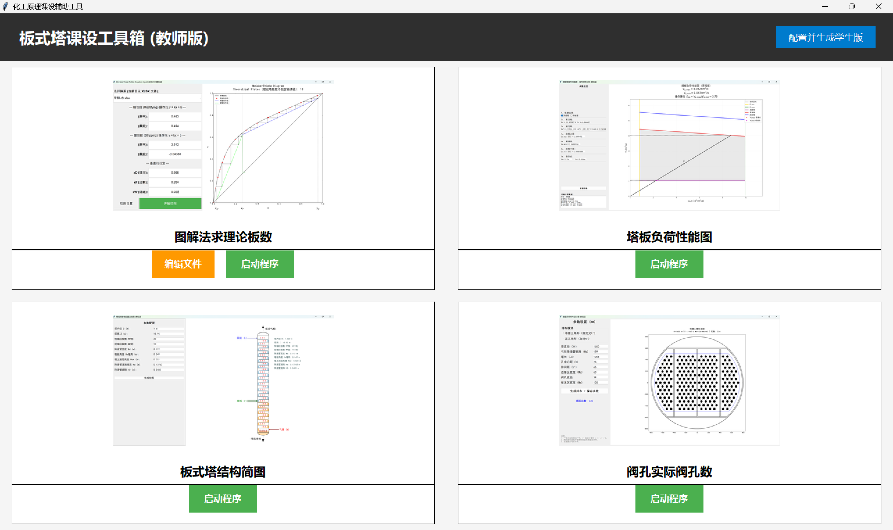
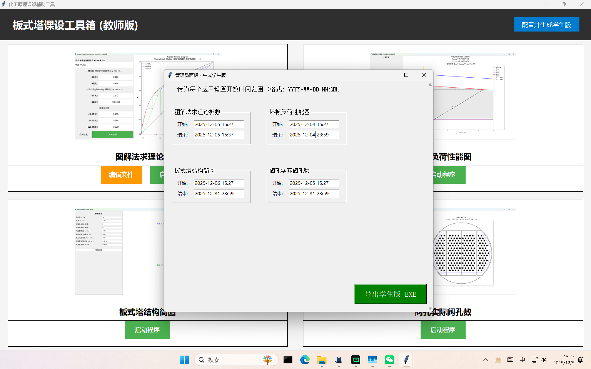
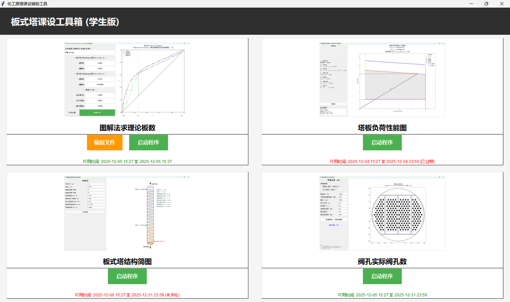
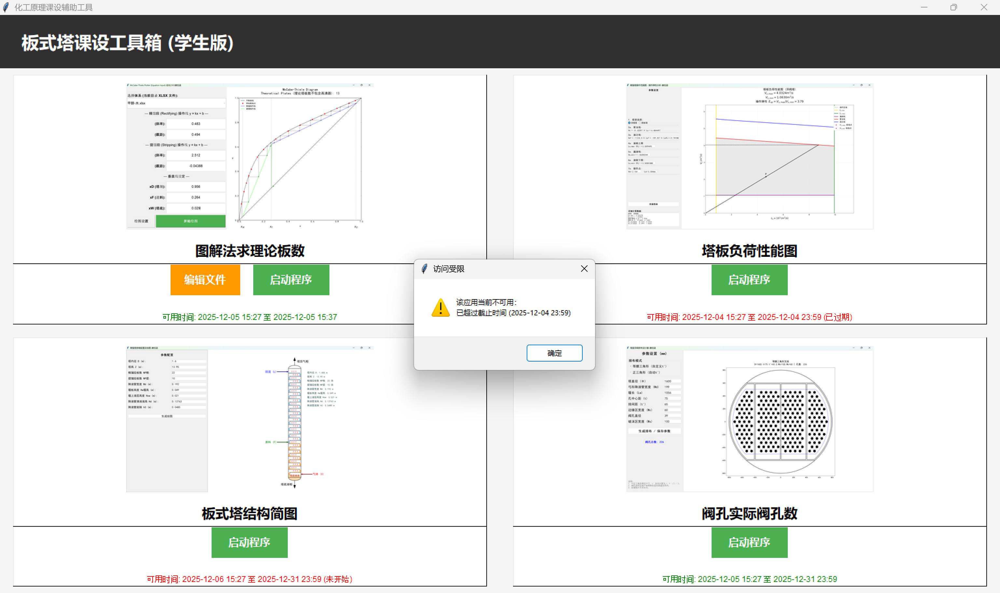

# 板式塔课设画图工具箱 (Tray Tower Course Design Drawing Toolbox)

## 简介 (Introduction)

本项目是一个专为化工原理课程设计（板式塔设计）开发的辅助工具箱。它集成了四个核心功能模块，帮助学生和教师快速进行计算、绘图和校验。软件分为教师版（管理员）和学生版，支持时间限制功能。

## 功能模块 (Features)

本工具箱包含以下四个主要应用程序：

1.  **图解法求理论板数 (McCabe-Thiele Plotter)**
    *   支持输入体系参数（斜率、截距、xD, xF, xW等）。
    *   自动绘制精馏段和提馏段操作线。
    *   计算并绘制理论板梯级。
    *   支持导出图片和保存/加载参数。

2.  **塔板负荷性能图 (Loading Performance Diagram)**
    *   支持浮阀塔和筛板塔。
    *   输入塔板几何参数和流体力学数据。
    *   自动绘制液沫夹带线、液泛线、漏液线等操作极限线。
    *   生成操作弹性区域图。

3.  **板式塔结构简图 (Tower Structure Diagram)**
    *   根据计算出的塔高、塔径、板间距等参数。
    *   生成板式塔的纵向结构简图。
    *   标注主要尺寸。

4.  **阀孔实际阀孔数 (Valve Tray Layout)**
    *   设计塔盘上的浮阀排布。
    *   支持等腰三角形或正三角形排布模式。
    *   自动计算阀孔总数。
    *   生成塔盘排布俯视图。

## 版本说明 (Versions)

*   **教师版 (Teacher Version)**:
    *   拥有管理员面板功能。
    *   可以为每个子应用设置开放时间范围（精确到分钟）。
    *   可以一键导出“学生版 EXE”。
    *   无使用时间限制。

*   **学生版 (Student Version)**:
    *   由教师版生成。
    *   启动时会检查网络时间。
    *   仅在教师设置的时间范围内可用，过期或未开始将无法进入应用。
    *   界面底部显示当前应用的可用时间。

## 使用截图 (Screenshots)

### 主界面

### 管理员面板 (设置时间限制)

### 图解法求理论板数

### 塔板负荷性能图

### 板式塔结构简图

### 阀孔实际阀孔数

## 开发环境 (Development)

*   **Language**: Python 3.11+
*   **GUI Framework**: Tkinter
*   **Plotting**: Matplotlib
*   **Data Processing**: NumPy, SciPy, Pandas
*   **Image Processing**: Pillow
*   **Time Sync**: Network time (Requests)

## 目录结构 (Structure)

*   `main.py`: 程序主入口，负责界面调度、权限管理和子进程启动。
*   `apps/`: 包含四个子应用的源代码和配置文件。
*   `features/`: 包含通用功能模块（如网络时间验证 `date_range.py`）。
*   `images/`: 存放说明文档的截图。
*   `build_teacher_version.bat`: 自动打包脚本 (PyInstaller)。

## 使用说明 (Usage)

1.  **运行**: 直接运行 `main.py` 或打包后的 EXE。
2.  **生成学生版**: 在教师版主页右上角点击“配置并生成学生版”，设置时间后导出。
3.  **文件管理**: 在支持文件操作的子应用中，点击“编辑文件”可管理 `data` 目录下的文件。

## 许可证 (License)

[Apache License 2.0](LICENSE)
